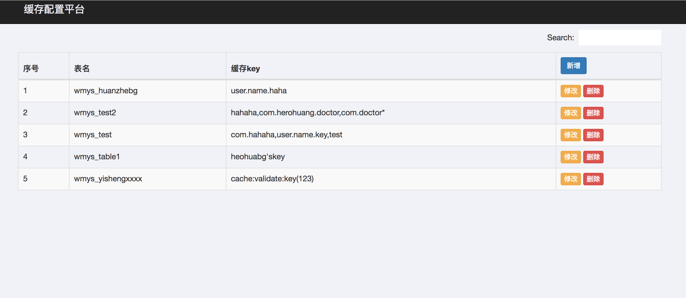
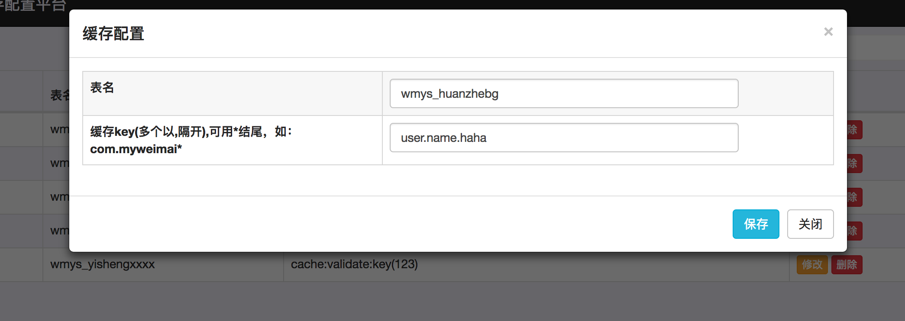

# 使用canal实现redis缓存刷新,提供web配置



## 背景
假设现有项目P1,是直连数据库(mysql)的。为了提高性能，现在要加上缓存(redis)，但是另有项目P2，也对数据库有操作,如何保证当P1加上redis后，P2对数据库修改后，P1从redis中获取的数据是最新的。有两种方案：
- 一种是P1的开发人员和P2开发人员协调，当P2对mysql有修改、增加等操作，必须清除P1使用到的相关缓存。当P1读redis时，发现缓存失效,再读mysql，获取最新数据。
- 一种是利用阿里巴巴的canal,获得mysql-binlog，根据mysql-binlog清除相关的缓存。这种方法的好处是不需要修改原来的程序。

## 使用到的技术
- [canal](https://github.com/alibaba/canal)
- springboot
- jedis

## 部署配置canal
canal的部署可以参考官方文档：[https://github.com/alibaba/canal/wiki/QuickStart](https://github.com/alibaba/canal/wiki/QuickStart)
配置的时候要注意：
- conf/canal.properties是canal本身的配置文件，基本上默认即可
- conf/example/instance.properties:应用的配置参数,一般需要修改其中的数据库连接配置

## 使用

### 1.启动canal：

```
sh bin/startup.sh
```

canal 的官方例子：
https://github.com/alibaba/canal/wiki/ClientExample

利用canal解析mysql-binlog，能够获取到执行的sql，修改的表数据等信息，我这里获取修改的表，根据表名去清除掉使用到这个表的相关缓存，所以这里有一个对应关系：`表名--缓存key`。

这里表名和缓存key的对应关系，为了方便，我将其存在一个属性文件中：`cache.properties`,并提供一个web界面来维护这个文件。

### 2.配置cache.properties
在计算机上任一位置建一文件：`cache.properties`,在项目的`application.properties`中有一属性：`cache.properties.path`，指向`cache.properties`文件的位置：

```
cache.properties.path=/Users/acheron/cache.properties
```

### 2.配置redis
在`util/RedisUtil.java`中配置redis相关信息,主要是以下三项：

```
// Redis的地址
private static String HOST = "127.0.0.1";
// Redis的端口号
private static int PORT = 6379;
// 访问密码
private static String PASS = null;
```

### 3.添加表-缓存key配置
运行项目，浏览器访问,添加一条记录，数据将会保存到`cache.properties`
```
table_name1=herohuang'skey
table_name2=user.name.haha
table_name3=hahaha,com.hero,com.herohuang*
table_name4=com.hahaha,user.name.key,test
```
注意cachekey的配置：
- 如果有多个，则用英文逗号隔开
- 如果要删除所有以`com.herohuang`开头的缓存，则可以`com.herohuang*`


